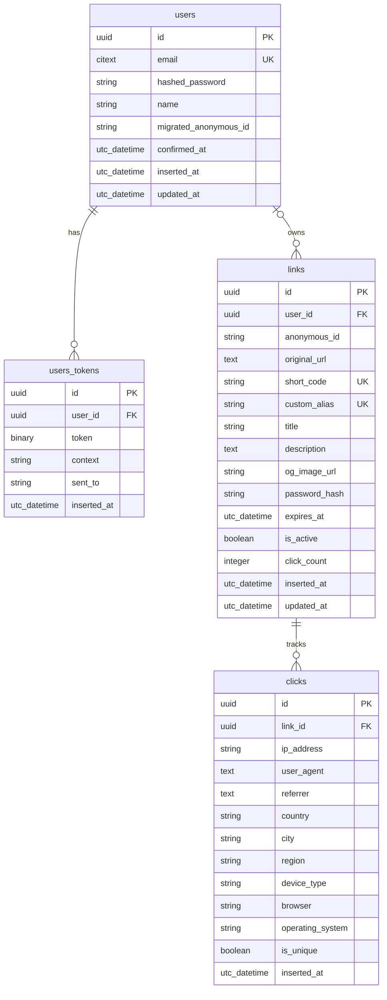

# jurl.ch - URL Shortener Web Application Concept


Astro Theme: [https://astro.build/themes/details/atelier-k/](https://astro.build/themes/details/atelier-k/)

Preview: https://atelier-ko-topaz.vercel.app/


[https://chat.deepseek.com/share/7rw30z0bcdcsy59sz8](https://chat.deepseek.com/share/7rw30z0bcdcsy59sz8)

Built with Elixir/Phoenix

---

## Table of Contents
0. [Docker Quickstart](#docker-quickstart)
0.1 [Proxmox LXC Quickstart](#proxmox-lxc-quickstart)
0.2 [LXC 101 Code Redeployment Quickstart](#5-quickstart-deploying-code-changes-to-lxc-container-101-phoenix-app)
1. [Core Vision](#core-vision)
2. [System Architecture](#system-architecture)
3. [Key Features](#key-features)
4. [Anonymous User System](#anonymous-user-system)
5. [Phoenix-Specific Implementation](#phoenix-specific-implementation)
6. [Database Schema](#database-schema)
7. [Performance Optimizations](#performance-optimizations)
8. [API Design](#api-design)
9. [Real-Time Dashboard Features](#real-time-dashboard-features)
10. [Anonymous-to-Authenticated Migration](#anonymous-to-authenticated-migration)
11. [User Interface Design](#user-interface-design)
12. [Deployment Considerations](#deployment-considerations)
13. [Unique Selling Points](#unique-selling-points)

---

## Docker Quickstart

To run the URL Shortener application containerized alongside a PostgreSQL database, follow these simple steps:

### 1. Prerequisites
Ensure you have [Docker](https://www.docker.com/) and **Docker Compose** installed on your system.

### 2. Start the Application
Run the following command in the project root directory to build the release and start the services in the background:
```bash
docker compose up --build -d
```

### 3. Verify Startup & Logs
You can monitor the startup logs to ensure the database migrations run successfully and the Phoenix web server starts up:
```bash
docker compose logs -f
```

### 4. Access the Web App
Once the server is running, navigate to:
```
http://localhost:4000
```
* **Host Database Port**: The containerized PostgreSQL database is exposed on host port `5433` (username: `postgres`, password: `postgres`, database: `jurl_dev`) to prevent conflicts with any local PostgreSQL instance you might have running on your host machine's port `5432`.

### 5. Stop the Application
To stop and clean up the containers, run:
```bash
docker compose down
```

### 6. Build Container after code changes

```bash
docker-compose up -d --build app
```

```text
  The reason you're not seeing the changes is because  docker-compose restart  simply stops and starts the existing Docker container
  without rebuilding the image or pulling in the new code.

  Since this  docker-compose.yml  is configured to build a production image from the local  Dockerfile  (rather than mounting the local
  filesystem as a volume for hot-reloading), you have to explicitly tell Docker to rebuild that image when the code changes.

  The correct command to apply local code changes to the Docker container is:

    docker-compose up -d --build
```

---

## Proxmox LXC Quickstart

To deploy `jurl` as unprivileged LXC containers on a Proxmox VE host (`192.168.1.19`), use the automated Ansible playbook provided in `ansible/`:

### 1. Architecture Specs
- **CT 100 (`postgres-db`):** `192.168.1.20` (PostgreSQL 16, DB `jurl_prod`, user `jurl`)
- **CT 101 (`phoenix-app`):** `192.168.1.21` (Elixir/Phoenix release, Nginx reverse proxy with LiveView WebSocket support)

### 2. Prerequisites
Install `ansible` and `sshpass` on your control machine:
```bash
brew install ansible sshpass
```

### 3. Deploy via Ansible
Run the playbook passing the Proxmox root password:
```bash
cd ansible
ansible-playbook -i inventory.ini playbook.yml --extra-vars "ansible_ssh_pass=dexter33143"
```

### 4. Container Access & Verification
- **Web Interface:** `http://192.168.1.21`
- **Shell Access to Container CT 101:**
  ```bash
  ssh root@192.168.1.19 "pct enter 101"
  ```
- **Service Status:**
  ```bash
  ssh root@192.168.1.19 "pct exec 101 -- systemctl status jurl"
  ```

### 5. Quickstart: Deploying Code Changes to LXC Container 101 (`phoenix-app`)

When local application code changes, use one of the following methods to build and deploy the updated release to container 101:

#### Method A: Automated Ansible Redeployment (Recommended)
From your control machine, execute the Ansible playbook with the `--tags redeploy` flag to sync code, compile production assets, assemble the Phoenix release, run migrations, and restart `jurl.service`:

```bash
cd ansible
ansible-playbook -i inventory.ini playbook.yml --tags redeploy --extra-vars "ansible_ssh_pass=dexter33143"
```

#### Method B: Direct CLI Deployment (Proxmox Host / Local Script)
If running directly on the Proxmox host (`192.168.1.19`):

```bash
# 1. Package updated source code (excluding build artifacts)
tar -czf /tmp/jurl-src.tar.gz -C /root/heuristicsyndicate/projects/jurl --exclude="_build" --exclude="deps" --exclude=".git" .

# 2. Push code to CT 101 and extract
pct push 101 /tmp/jurl-src.tar.gz /tmp/jurl-src.tar.gz
pct exec 101 -- bash -c "mkdir -p /tmp/jurl-build && tar -xzf /tmp/jurl-src.tar.gz -C /tmp/jurl-build"

# 3. Fetch dependencies, compile assets, build release, run migrations, and restart service
pct exec 101 -- bash -c "cd /tmp/jurl-build && export LANG=C.UTF-8 && \
  MIX_ENV=prod mix deps.get --only prod && \
  MIX_ENV=prod mix assets.deploy && \
  MIX_ENV=prod mix release --path /opt/jurl --overwrite && \
  chown -R phoenix:phoenix /opt/jurl && \
  export \$(cat /etc/jurl/jurl.env | xargs) && /opt/jurl/bin/migrate && \
  systemctl restart jurl"
```

For detailed variables and troubleshooting, refer to [ansible/README.md](ansible/README.md).

---

## Core Vision

A high-performance, real-time URL shortening service that combines Elixir's concurrency model and Phoenix's real-time capabilities to provide instant analytics, custom branding, and enterprise-grade reliability. The platform supports both anonymous and authenticated users with a seamless transition path, allowing immediate value delivery without requiring registration while incentivizing account creation through progressive feature exposure.

---

## System Architecture

```
┌─────────────────┐     ┌──────────────────┐     ┌─────────────────┐
│   Phoenix App   │────▶│  PostgreSQL DB    │     │    Redis Cache   │
│   (Cowboy)      │     │  (Primary Store)  │     │  (Hot URLs)      │
└─────────────────┘     └──────────────────┘     └─────────────────┘
         │                                                        │
         ▼                                                        ▼
┌─────────────────┐     ┌──────────────────┐     ┌─────────────────┐
│  LiveView       │     │  Oban/Quantum    │     │  ETS Cache      │
│  Dashboard      │     │  (Background)    │     │  (Ultra-Fast)   │
└─────────────────┘     └──────────────────┘     └─────────────────┘
         │                                                        │
         ▼                                                        ▼
┌─────────────────┐     ┌──────────────────┐     ┌─────────────────┐
│  Anonymous      │     │  Auth System     │     │  Telemetry      │
│  Session Store  │     │  (OAuth/JWT)     │     │  (Monitoring)   │
└─────────────────┘     └──────────────────┘     └─────────────────┘
```

### User Identity Flow

```
┌──────────────┐
│  New Visitor  │
└──────┬───────┘
       │
       ▼
┌──────────────────┐      ┌─────────────────┐
│ Anonymous Session │─────▶│ Create Links    │
│ (auto-created)   │      │ (limited)       │
└──────┬───────────┘      └────────┬────────┘
       │                           │
       │ Prompt after               │ Progressive
       │ engagement                 │ features
       │                           │
       ▼                           ▼
┌──────────────────┐      ┌─────────────────┐
│ Register/Login   │─────▶│ Claim Anonymous │
│ (optional)       │      │ Links           │
└──────────────────┘      └─────────────────┘
```

---

## Key Features

### 1. Core URL Shortening
- Custom alias support (`jurl.ch/my-brand`)
- Automatic short code generation using Base62 encoding
- QR code generation for each shortened URL
- Bulk URL shortening via CSV upload
- Password-protected links with hashed passwords
- Expiration dates for temporary links
- Edit destination URLs without changing short links

### 2. Real-Time Analytics (Phoenix LiveView)
- Live click counter updating without page refresh
- Geographic heat map of clicks (WebSocket-powered)
- Device/browser breakdown with real-time charts
- Referrer tracking with instant updates
- Time-series graphs showing click patterns
- Active now counter showing current visitors
- Export capabilities (CSV, PDF)

### 3. Smart Features
- **Link Preview**: OG metadata scraping with caching
- **A/B Testing**: Create multiple destination URLs with traffic splitting
- **Campaign Tags**: UTM parameter builder with analytics grouping
- **Smart Routing**: Device/location-based URL redirection
- **Link Retargeting**: Modify destinations without changing short URL
- **Deep Linking**: Mobile app deep link support

### 4. User Management
- OAuth integration (Google, GitHub, Twitter)
- Team/organization accounts
- Role-based access control (Admin, Manager, Member)
- API key generation with configurable rate limiting
- White-label domains (CNAME support)
- Usage quotas and billing tiers

### 5. Anonymous User Features
- Instant link creation without registration
- Session-based link management
- Basic analytics for anonymous links
- Clear upgrade path with benefit highlighting
- Automatic link claiming upon registration

---

## Anonymous User System

### Identity Model

```elixir
defmodule jurl.Accounts.Identity do
  @moduledoc """
  Virtual schema representing the current user identity.
  Can be either anonymous or authenticated.
  """
  
  use Ecto.Schema
  
  @type t :: %__MODULE__{
    type: :anonymous | :authenticated,
    anonymous_id: String.t() | nil,
    user_id: integer() | nil,
    user: jurl.Accounts.User.t() | nil
  }
  
  embedded_schema do
    field :type, Ecto.Enum, values: [:anonymous, :authenticated]
    field :anonymous_id, :string
    field :user_id, :integer
  end
  
  def new_anonymous(anonymous_id) do
    %__MODULE__{
      type: :anonymous,
      anonymous_id: anonymous_id,
      user_id: nil,
      user: nil
    }
  end
  
  def new_authenticated(user) do
    %__MODULE__{
      type: :authenticated,
      anonymous_id: nil,
      user_id: user.id,
      user: user
    }
  end
end
```

### Anonymous Session Management

```elixir
defmodule jurlWeb.Plugs.AnonymousUser do
  import Plug.Conn
  require Logger
  
  @session_key "anonymous_user_id"
  @cookie_name "sl_anon_id"
  @cookie_max_age 365 * 24 * 60 * 60  # 1 year
  
  def init(opts), do: opts
  
  def call(conn, _opts) do
    case get_anonymous_id(conn) do
      nil -> 
        new_id = generate_anonymous_id()
        Logger.debug("Creating new anonymous session: #{String.slice(new_id, 0, 8)}...")
        
        conn
        |> put_session(@session_key, new_id)
        |> put_resp_cookie(@cookie_name, new_id, 
            max_age: @cookie_max_age,
            http_only: true,
            secure: true,
            same_site: "Lax"
          )
        |> assign_identity(:anonymous, new_id, nil)
      
      id when is_binary(id) ->
        case conn.assigns[:current_user] do
          nil ->
            assign_identity(conn, :anonymous, id, nil)
          user ->
            assign_identity(conn, :authenticated, id, user)
        end
    end
  end
  
  defp get_anonymous_id(conn) do
    get_session(conn, @session_key) || 
    conn.cookies[@cookie_name]
  end
  
  defp generate_anonymous_id do
    :crypto.strong_rand_bytes(32)
    |> Base.url_encode64(padding: false)
  end
  
  defp assign_identity(conn, type, anon_id, user) do
    identity = case type do
      :anonymous -> jurl.Accounts.Identity.new_anonymous(anon_id)
      :authenticated -> jurl.Accounts.Identity.new_authenticated(user)
    end
    
    conn
    |> assign(:anonymous_id, anon_id)
    |> assign(:current_user, user)
    |> assign(:identity, identity)
    |> assign(:is_authenticated, not is_nil(user))
  end
end
```

### Anonymous Link Management

```elixir
defmodule jurl.Shortener do
  alias jurl.Repo
  alias jurl.Shortener.Link
  alias jurl.Accounts.User
  alias jurl.Anonymous.Limiter
  
  @doc """
  Creates a shortened link for either anonymous or authenticated users.
  Automatically detects user context from connection assigns.
  """
  def create_link(%Plug.Conn{} = conn, attrs) do
    identity = conn.assigns.identity
    
    cond do
      identity.type == :authenticated ->
        create_user_link(identity.user, attrs)
      
      identity.type == :anonymous ->
        with :ok <- Limiter.check_limits(identity.anonymous_id) do
          create_anonymous_link(identity.anonymous_id, attrs)
        end
    end
  end
  
  @doc """
  Creates a link for an anonymous user with session tracking.
  """
  def create_anonymous_link(anonymous_id, attrs) do
    attrs = attrs
    |> Map.put(:anonymous_id, anonymous_id)
    |> Map.put(:owner_type, "anonymous")
    
    %Link{}
    |> Link.changeset(attrs)
    |> Repo.insert()
    |> case do
      {:ok, link} -> 
        broadcast_link_created(link)
        Limiter.increment_link_count(anonymous_id)
        Anonymous.SessionStore.add_link(anonymous_id, link.short_code)
        {:ok, link}
      error -> error
    end
  end
  
  @doc """
  Creates a link for an authenticated user.
  """
  def create_user_link(%User{id: user_id}, attrs) do
    attrs = attrs
    |> Map.put(:user_id, user_id)
    |> Map.put(:owner_type, "authenticated")
    
    %Link{}
    |> Link.changeset(attrs)
    |> Repo.insert()
    |> case do
      {:ok, link} -> 
        broadcast_link_created(link)
        {:ok, link}
      error -> error
    end
  end
  
  @doc """
  Lists links owned by the current identity (anonymous or authenticated).
  """
  def list_links_for_identity(%Plug.Conn{} = conn, params \\ %{}) do
    identity = conn.assigns.identity
    
    base_query = from l in Link, 
      where: l.is_active == true,
      order_by: [desc: l.inserted_at]
    
    query = case identity.type do
      :anonymous ->
        from l in base_query, where: l.anonymous_id == ^identity.anonymous_id
        
      :authenticated ->
        from l in base_query, where: l.user_id == ^identity.user_id
    end
    
    Repo.paginate(query, params)
  end
  
  @doc """
  Checks if a link is owned by the current identity.
  """
  def owned_by?(%Link{} = link, %Plug.Conn{} = conn) do
    identity = conn.assigns.identity
    
    case identity.type do
      :anonymous -> link.anonymous_id == identity.anonymous_id
      :authenticated -> link.user_id == identity.user_id
    end
  end
  
  @doc """
  Gets link by short code with ownership verification.
  """
  def get_link_for_identity(short_code, %Plug.Conn{} = conn) do
    link = Repo.get_by(Link, short_code: short_code)
    
    if link && owned_by?(link, conn) do
      {:ok, link}
    else
      {:error, :not_found}
    end
  end
  
  # Private helpers
  defp broadcast_link_created(link) do
    Phoenix.PubSub.broadcast(
      jurl.PubSub,
      "links:created",
      {:link_created, link}
    )
  end
end
```

### Anonymous Usage Limiter

```elixir
defmodule jurl.Anonymous.Limiter do
  @moduledoc """
  Manages rate limits and restrictions for anonymous users.
  Provides clear upgrade paths to premium features.
  """
  
  use GenServer
  
  # Limits configuration
  @max_links_per_session 50
  @max_rate_per_minute 10
  @link_lifetime_days 30
  @max_analytics_days 7
  
  # Allowed and restricted features
  @allowed_features [
    :basic_shorten,
    :custom_alias,
    :qr_code,
    :basic_analytics
  ]
  
  @restricted_features [
    :advanced_analytics,
    :analytics_export,
    :team_collaboration,
    :api_access,
    :bulk_shorten,
    :password_protected_links,
    :link_retargeting,
    :white_label_domains
  ]
  
  def start_link(_opts) do
    GenServer.start_link(__MODULE__, %{}, name: __MODULE__)
  end
  
  @doc """
  Check if anonymous user has exceeded any limits.
  Returns :ok or {:error, reason} with upgrade message.
  """
  def check_limits(anonymous_id) do
    with :ok <- check_link_count(anonymous_id),
         :ok <- check_rate_limit(anonymous_id) do
      :ok
    end
  end
  
  def check_link_count(anonymous_id) do
    count = get_link_count(anonymous_id)
    if count >= @max_links_per_session do
      {:error, :max_links}
    else
      :ok
    end
  end
  
  def check_rate_limit(anonymous_id) do
    current_minute = System.system_time(:second) |> div(60)
    key = {anonymous_id, current_minute}
    count = :ets.update_counter(:anon_rate_limits, key, {2, 1}, {key, 1, current_minute})
    
    if count > @max_rate_per_minute do
      {:error, :rate_limit}
    else
      :ok
    end
  end
  
  def increment_link_count(anonymous_id) do
    :ets.update_counter(:anon_link_counts, anonymous_id, {2, 1}, {anonymous_id, 1})
  end
  
  @doc """
  Returns a user-friendly upgrade message based on the limit reached.
  """
  def upgrade_prompt(:max_links) do
    """
    You've reached the limit of #{@max_links_per_session} anonymous links. 
    Create a free account to create unlimited links and unlock advanced features!
    """
  end
  
  def upgrade_prompt(:rate_limit) do
    """
    You're creating links too quickly. 
    Sign up for higher rate limits and API access!
    """
  end
  
  def upgrade_prompt(:feature_restricted) do
    """
    This feature requires an account. 
    Sign up to access advanced analytics, team collaboration, and more!
    """
  end
  
  defp get_link_count(anonymous_id) do
    case :ets.lookup(:anon_link_counts, anonymous_id) do
      [{^anonymous_id, count}] -> count
      [] -> 0
    end
  end
  
  def allowed_features, do: @allowed_features
  def restricted_features, do: @restricted_features
end
```

### Anonymous Session Store (ETS-based)

```elixir
defmodule jurl.Anonymous.SessionStore do
  @moduledoc """
  ETS-based session store for anonymous user links.
  Survives across requests within the same session.
  Provides fast, in-memory access to session data.
  """
  
  @table_name :anonymous_sessions
  @session_ttl 30 * 24 * 60 * 60  # 30 days in seconds
  
  def init do
    :ets.new(@table_name, [
      :named_table,
      :public,
      :set,
      read_concurrency: true,
      write_concurrency: true
    ])
  end
  
  def add_link(anonymous_id, short_code) do
    links = get_links(anonymous_id)
    timestamp = System.system_time(:second)
    new_link = %{
      short_code: short_code,
      created_at: timestamp
    }
    
    :ets.insert(@table_name, {anonymous_id, [new_link | links], timestamp})
  end
  
  def get_links(anonymous_id) do
    case :ets.lookup(@table_name, anonymous_id) do
      [{^anonymous_id, links, _}] -> links
      [] -> []
    end
  end
  
  def get_link_count(anonymous_id) do
    anonymous_id |> get_links() |> length()
  end
  
  def remove_link(anonymous_id, short_code) do
    links = get_links(anonymous_id)
    updated_links = Enum.reject(links, &(&1.short_code == short_code))
    timestamp = System.system_time(:second)
    :ets.insert(@table_name, {anonymous_id, updated_links, timestamp})
  end
  
  def clear_session(anonymous_id) do
    :ets.delete(@table_name, anonymous_id)
  end
  
  # Cleanup expired anonymous sessions
  def cleanup_expired do
    now = System.system_time(:second)
    cutoff = now - @session_ttl
    
    :ets.select_delete(@table_name, [
      {{:"$1", :_, :"$2"}, [{:<, :"$2", cutoff}], [true]}
    ])
  end
end
```

---

## Phoenix-Specific Implementation

### Project Structure

```
lib/
├── jurl/
│   ├── application.ex
│   ├── accounts/
│   │   ├── user.ex                  # User schema
│   │   ├── team.ex                  # Team schema
│   │   ├── identity.ex              # Virtual identity schema
│   │   └── migration_service.ex     # Anonymous→Auth migration
│   ├── shortener/
│   │   ├── code_generator.ex        # Base62 encoding
│   │   ├── url_validator.ex         # URL validation & normalization
│   │   ├── redirector.ex            # Redirection logic
│   │   └── link.ex                  # Link schema
│   ├── analytics/
│   │   ├── click_tracker.ex         # Click event processing (GenServer)
│   │   ├── geolocator.ex            # IP-to-location service
│   │   └── stats_aggregator.ex      # Statistics computation
│   ├── anonymous/
│   │   ├── limiter.ex               # Anonymous usage limits
│   │   ├── session_store.ex         # ETS session storage
│   │   └── auth_prompt.ex           # Progressive auth prompts
│   └── cache/
│       └── url_cache.ex             # ETS hot URL cache
│
├── jurl_web/
│   ├── endpoint.ex
│   ├── router.ex
│   ├── plugs/
│   │   ├── anonymous_user.ex        # Anonymous session plug
│   │   └── rate_limiter.ex          # Rate limiting plug
│   ├── controllers/
│   │   ├── link_controller.ex       # URL shortening endpoints
│   │   ├── redirect_controller.ex   # Redirection handler
│   │   └── api/
│   │       └── v1/
│   │           └── link_controller.ex
│   └── live/
│       ├── dashboard_live.ex        # Real-time analytics dashboard
│       ├── link_builder_live.ex     # URL creation interface
│       ├── auth_prompt_live.ex      # Authentication prompts
│       └── components/
│           ├── link_card.ex         # Reusable link display
│           ├── analytics_chart.ex   # Real-time charts
│           └── identity_badge.ex    # User identity indicator
```

### Key Elixir Patterns

#### 1. GenServer for Click Processing

```elixir
defmodule jurl.Analytics.ClickProcessor do
  use GenServer
  
  @flush_interval 5_000  # 5 seconds
  @batch_size 100
  
  def start_link(_opts) do
    GenServer.start_link(__MODULE__, %{buffer: [], timer: nil}, name: __MODULE__)
  end
  
  def init(state) do
    timer = Process.send_after(self(), :flush, @flush_interval)
    {:ok, %{state | timer: timer}}
  end
  
  def track_click(link_id, click_data) do
    GenServer.cast(__MODULE__, {:track_click, link_id, click_data})
  end
  
  def handle_cast({:track_click, link_id, click_data}, state) do
    new_buffer = [{link_id, click_data} | state.buffer]
    
    if length(new_buffer) >= @batch_size do
      flush_buffer(new_buffer)
      {:noreply, %{state | buffer: []}}
    else
      {:noreply, %{state | buffer: new_buffer}}
    end
  end
  
  def handle_info(:flush, state) do
    flush_buffer(state.buffer)
    timer = Process.send_after(self(), :flush, @flush_interval)
    {:noreply, %{state | buffer: [], timer: timer}}
  end
  
  defp flush_buffer(buffer) when buffer == [], do: :ok
  defp flush_buffer(buffer) do
    now = NaiveDateTime.utc_now() |> NaiveDateTime.truncate(:second)
    
    clicks = Enum.map(buffer, fn {link_id, data} ->
      %{
        link_id: link_id,
        ip_address: data.ip,
        user_agent: data.user_agent,
        referrer: data.referrer,
        country: data.country,
        city: data.city,
        device_type: data.device_type,
        browser: data.browser,
        inserted_at: now
      }
    end)
    
    jurl.Repo.insert_all(jurl.Analytics.Click, clicks)
    
    # Broadcast for real-time updates
    Enum.each(buffer, fn {link_id, data} ->
      Phoenix.PubSub.broadcast(
        jurl.PubSub,
        "analytics:#{link_id}",
        {:new_click, data}
      )
    end)
  end
end
```

#### 2. ETS Hot URL Cache

```elixir
defmodule jurl.Cache.URLCache do
  @moduledoc """
  ETS-based cache for frequently accessed URLs.
  Provides sub-millisecond lookups for hot links.
  """
  
  @table_name :url_cache
  @max_cache_size 10_000
  
  def init do
    :ets.new(@table_name, [
      :named_table,
      :public,
      :set,
      read_concurrency: true,
      write_concurrency: true
    ])
  end
  
  def get_url(short_code) do
    case :ets.lookup(@table_name, short_code) do
      [{^short_code, url, _, _}] ->
        update_access_count(short_code)
        {:ok, url}
      [] ->
        {:error, :not_found}
    end
  end
  
  def put_url(short_code, url, metadata \\ %{}) do
    cache_size = :ets.info(@table_name, :size)
    
    if cache_size >= @max_cache_size do
      evict_least_used()
    end
    
    :ets.insert(@table_name, {
      short_code,
      url,
      System.system_time(:second),
      metadata
    })
  end
  
  defp update_access_count(short_code) do
    :ets.update_counter(@table_name, short_code, {4, 1})
  end
  
  defp evict_least_used do
    # Simple LRU eviction based on access count
    case :ets.tab2list(@table_name) do
      [] -> :ok
      entries ->
        {key, _, _, _} = Enum.min_by(entries, fn {_, _, access_count, _} -> access_count end)
        :ets.delete(@table_name, key)
    end
  end
  
  def cache_stats do
    %{
      size: :ets.info(@table_name, :size),
      memory: :ets.info(@table_name, :memory) * :erlang.system_info(:wordsize)
    }
  end
end
```

#### 3. Phoenix PubSub for Real-Time Updates

```elixir
defmodule jurlWeb.AnalyticsChannel do
  use Phoenix.Channel
  
  def join("analytics:" <> link_id, _params, socket) do
    if authorized?(socket, link_id) do
      {:ok, assign(socket, :link_id, link_id)}
    else
      {:error, %{reason: "unauthorized"}}
    end
  end
  
  def handle_in("request_initial_stats", _payload, socket) do
    stats = jurl.Analytics.get_stats(socket.assigns.link_id)
    {:reply, {:ok, stats}, socket}
  end
  
  # Broadcast handler is in ClickProcessor GenServer
  
  defp authorized?(socket, link_id) do
    identity = socket.assigns.identity
    
    case identity.type do
      :anonymous ->
        jurl.Shortener.anonymous_link?(link_id, identity.anonymous_id)
      :authenticated ->
        jurl.Shortener.user_link?(link_id, identity.user_id)
    end
  end
end
```

### Phoenix Router Configuration

```elixir
defmodule jurlWeb.Router do
  use jurlWeb, :router
  
  pipeline :browser do
    plug :accepts, ["html"]
    plug :fetch_session
    plug :fetch_live_flash
    plug :put_root_layout, {jurlWeb.LayoutView, :root}
    plug :protect_from_forgery
    plug :put_secure_browser_headers
    plug jurlWeb.Plugs.AnonymousUser  # Must be before auth
    plug :fetch_current_user
  end
  
  pipeline :api do
    plug :accepts, ["json"]
    plug :fetch_session
    plug jurlWeb.Plugs.AnonymousUser
    plug :api_auth
  end
  
  pipeline :redirect do
    plug :accepts, ["html", "json"]
    plug jurlWeb.Plugs.RateLimiter, rate: 1000
  end
  
  scope "/", jurlWeb do
    pipe_through :browser
    
    get "/", PageController, :index
    get "/dashboard", DashboardController, :index
    
    # LiveView routes
    live "/create", LinkBuilderLive, :new
    live "/dashboard/live", DashboardLive, :index
    live "/links/:short_code", LinkAnalyticsLive, :show
  end
  
  scope "/", jurlWeb do
    pipe_through :redirect
    
    get "/:short_code", RedirectController, :redirect
  end
  
  scope "/api/v1", jurlWeb.Api.V1, as: :api_v1 do
    pipe_through :api
    
    resources "/links", LinkController, only: [:create, :index, :show, :delete]
    get "/links/:id/stats", LinkController, :stats
    post "/links/bulk", LinkController, :bulk_create
  end
  
  # GraphQL endpoint
  scope "/api" do
    pipe_through :api
    
    forward "/graphql", Absinthe.Plug, schema: jurlWeb.GraphQL.Schema
    forward "/graphiql", Absinthe.Plug.GraphiQL, schema: jurlWeb.GraphQL.Schema
  end
end
```

### LiveView Dashboard Implementation

```elixir
defmodule jurlWeb.DashboardLive do
  use jurlWeb, :live_view
  
  alias jurl.Analytics
  
  @impl true
  def mount(_params, _session, socket) do
    identity = socket.assigns.identity
    
    if connected?(socket) do
      case identity.type do
        :anonymous ->
          Analytics.subscribe_to_anonymous_links(identity.anonymous_id)
        :authenticated ->
          Analytics.subscribe_to_user_links(identity.user_id)
      end
    end
    
    {:ok, assign(socket, 
      links: [],
      total_clicks: 0,
      active_visitors: 0,
      click_history: []
    )}
  end
  
  @impl true
  def handle_info({:new_click, click_data}, socket) do
    socket = socket
    |> update(:total_clicks, &(&1 + 1))
    |> update(:click_history, fn history ->
      [click_data | history] |> Enum.take(100)
    end)
    |> update(:active_visitors, fn _ ->
      Analytics.get_active_visitors(socket.assigns.identity)
    end)
    
    {:noreply, socket}
  end
  
  @impl true
  def handle_info({:link_created, link}, socket) do
    {:noreply, update(socket, :links, fn links -> [link | links] end)}
  end
  
  @impl true
  def handle_event("export_csv", _params, socket) do
    if socket.assigns.identity.type == :authenticated do
      csv_data = Analytics.export_csv(socket.assigns.links)
      {:noreply, push_event(socket, "download", %{data: csv_data, filename: "analytics.csv"})}
    else
      {:noreply, 
        socket
        |> put_flash(:info, "Create an account to export analytics!")
        |> push_redirect(to: "/register")
      }
    end
  end
end
```

---

## Database Schema

### ER Diagram (Entity-Relationship)



### Ecto Schemas

```elixir
defmodule jurl.Shortener.Link do
  use Ecto.Schema
  import Ecto.Changeset
  
  schema "links" do
    field :original_url, :string
    field :short_code, :string
    field :custom_alias, :string
    field :title, :string
    field :description, :string
    field :og_image_url, :string
    field :password_hash, :string
    field :expires_at, :utc_datetime
    field :is_active, :boolean, default: true
    field :click_count, :integer, default: 0
    
    # Ownership fields
    field :anonymous_id, :string
    belongs_to :user, jurl.Accounts.User
    
    # Virtual fields
    field :owner_type, :string, virtual: true
    
    has_many :clicks, jurl.Analytics.Click
    has_many :campaign_tags, jurl.Marketing.CampaignTag
    
    timestamps()
  end
  
  @required_fields [:original_url]
  @optional_fields [:custom_alias, :password_hash, :expires_at, :title, :description]
  
  def changeset(link, attrs) do
    link
    |> cast(attrs, @required_fields ++ @optional_fields ++ [:anonymous_id, :user_id])
    |> validate_required(@required_fields)
    |> validate_url(:original_url)
    |> generate_short_code()
    |> validate_unique_short_code()
    |> hash_password()
    |> validate_expiry()
    |> unique_constraint(:short_code)
    |> unique_constraint(:custom_alias)
  end
  
  defp validate_url(changeset, field) do
    validate_change(changeset, field, fn _, url ->
      case URI.parse(url) do
        %URI{scheme: scheme} when scheme in ["http", "https"] -> []
        _ -> [{field, "Must be a valid HTTP or HTTPS URL"}]
      end
    end)
  end
  
  defp generate_short_code(changeset) do
    if get_field(changeset, :custom_alias) do
      changeset
    else
      code = jurl.Shortener.CodeGenerator.generate()
      put_change(changeset, :short_code, code)
    end
  end
  
  defp hash_password(changeset) do
    case get_change(changeset, :password_hash) do
      nil -> changeset
      password ->
        put_change(changeset, :password_hash, Bcrypt.hash_pwd_salt(password))
    end
  end
  
  defp validate_expiry(changeset) do
    case get_change(changeset, :expires_at) do
      nil -> changeset
      expiry ->
        if DateTime.compare(expiry, DateTime.utc_now()) == :gt do
          changeset
        else
          add_error(changeset, :expires_at, "must be in the future")
        end
    end
  end
end

defmodule jurl.Analytics.Click do
  use Ecto.Schema
  
  @primary_key {:id, :binary_id, autogenerate: true}
  schema "clicks" do
    field :ip_address, :string
    field :user_agent, :string
    field :referrer, :string
    field :country, :string
    field :city, :string
    field :region, :string
    field :device_type, :string
    field :browser, :string
    field :operating_system, :string
    field :is_unique, :boolean, default: false
    
    belongs_to :link, jurl.Shortener.Link, type: :binary_id
    
    timestamps(updated_at: false)
  end
end

defmodule jurl.Accounts.User do
  use Ecto.Schema
  
  schema "users" do
    field :email, :string
    field :password_hash, :string
    field :name, :string
    field :avatar_url, :string
    field :is_active, :boolean, default: true
    field :plan, Ecto.Enum, values: [:free, :pro, :enterprise], default: :free
    
    # Migration tracking
    field :migrated_anonymous_id, :string
    
    has_many :links, jurl.Shortener.Link
    has_many :api_keys, jurl.Accounts.ApiKey
    belongs_to :team, jurl.Accounts.Team
    
    timestamps()
  end
end
```

### Database Migrations

```elixir
defmodule jurl.Repo.Migrations.CreateLinks do
  use Ecto.Migration
  
  def change do
    create table(:links) do
      add :original_url, :text, null: false
      add :short_code, :string, null: false
      add :custom_alias, :string
      add :title, :string
      add :description, :text
      add :og_image_url, :string
      add :password_hash, :string
      add :expires_at, :utc_datetime
      add :is_active, :boolean, default: true, null: false
      add :click_count, :integer, default: 0
      
      # Ownership fields
      add :anonymous_id, :string
      add :user_id, references(:users, on_delete: :nothing)
      
      timestamps()
    end
    
    # Indexes for efficient lookups
    create unique_index(:links, [:short_code])
    create unique_index(:links, [:custom_alias])
    create index(:links, [:anonymous_id])
    create index(:links, [:user_id])
    create index(:links, [:anonymous_id, :user_id])
    create index(:links, [:expires_at])
    create index(:links, [:inserted_at])
  end
end

defmodule jurl.Repo.Migrations.CreateClicks do
  use Ecto.Migration
  
  def change do
    create table(:clicks, primary_key: false) do
      add :id, :binary_id, primary_key: true
      add :link_id, references(:links, on_delete: :delete_all, type: :binary_id), null: false
      
      add :ip_address, :string
      add :user_agent, :text
      add :referrer, :text
      add :country, :string
      add :city, :string
      add :region, :string
      add :device_type, :string
      add :browser, :string
      add :operating_system, :string
      add :is_unique, :boolean, default: false
      
      timestamps(updated_at: false)
    end
    
    create index(:clicks, [:link_id, :inserted_at])
    create index(:clicks, [:country, :inserted_at])
    create index(:clicks, [:inserted_at])
  end
end
```

---

## Performance Optimizations

### URL Resolution Pipeline

```elixir
defmodule jurlWeb.RedirectController do
  use jurlWeb, :controller
  
  def redirect(conn, %{"short_code" => short_code}) do
    result = resolve_url(short_code)
    
    case result do
      {:ok, url, link} ->
        # Fire-and-forget click tracking
        track_click_async(link, conn)
        
        conn
        |> put_status(:found)
        |> redirect(external: url)
        
      {:error, :expired} ->
        conn
        |> put_status(:gone)
        |> json(%{error: "Link has expired"})
        
      {:error, :not_found} ->
        conn
        |> put_status(:not_found)
        |> json(%{error: "Link not found"})
    end
  end
  
  defp resolve_url(short_code) do
    # Tiered cache lookup
    case URLCache.get_url(short_code) do
      {:ok, url} -> 
        # ETS cache hit - sub-millisecond
        {:ok, url, %{id: short_code}}
      
      {:error, :not_found} ->
        # Cache miss - check database
        case Repo.get_by(Link, short_code: short_code, is_active: true) do
          %Link{expires_at: expires} = link when not is_nil(expires) ->
            if DateTime.compare(expires, DateTime.utc_now()) == :gt do
              URLCache.put_url(short_code, link.original_url)
              {:ok, link.original_url, link}
            else
              {:error, :expired}
            end
            
          %Link{} = link ->
            URLCache.put_url(short_code, link.original_url)
            {:ok, link.original_url, link}
            
          nil ->
            {:error, :not_found}
        end
    end
  end
  
  defp track_click_async(link, conn) do
    click_data = %{
      ip: conn.remote_ip |> :inet.ntoa() |> to_string(),
      user_agent: get_req_header(conn, "user-agent") |> List.first(),
      referrer: get_req_header(conn, "referer") |> List.first()
    }
    
    ClickProcessor.track_click(link.id, click_data)
  end
end
```

### Response Time Targets

```
Resolution Path          Expected Time    Cache Hit Rate
─────────────────────────────────────────────────────────
ETS Cache (Hot URLs)     < 0.5ms          80% of traffic
Redis Cache (Warm URLs)  < 2ms            15% of traffic  
Database (Cold URLs)     < 10ms           5% of traffic
404 (Not Found)          < 5ms            N/A
```

### Cache Warming Strategy

```elixir
defmodule jurl.Cache.Warmer do
  @moduledoc """
  Periodically warms the cache with frequently accessed URLs.
  Uses Oban for scheduled execution.
  """
  
  use Oban.Worker, queue: :cache_warming, max_attempts: 3
  
  @impl true
  def perform(_job) do
    # Get top 1000 most accessed links
    top_links = 
      jurl.Shortener.Link
      |> where([l], l.is_active == true)
      |> order_by([l], desc: l.click_count)
      |> limit(1000)
      |> jurl.Repo.all()
    
    # Warm ETS cache
    Enum.each(top_links, fn link ->
      jurl.Cache.URLCache.put_url(
        link.short_code, 
        link.original_url,
        %{title: link.title, click_count: link.click_count}
      )
    end)
    
    :ok
  end
end
```

---

## API Design

### REST API

```elixir
defmodule jurlWeb.Api.V1.LinkController do
  use jurlWeb, :controller
  
  action_fallback jurlWeb.Api.FallbackController
  
  def create(conn, %{"url" => _url} = params) do
    with {:ok, link} <- jurl.Shortener.create_link(conn, params) do
      conn
      |> put_status(:created)
      |> render("show.json", link: link)
    end
  end
  
  def index(conn, params) do
    links = jurl.Shortener.list_links_for_identity(conn, params)
    render(conn, "index.json", links: links)
  end
  
  def show(conn, %{"id" => short_code}) do
    case jurl.Shortener.get_link_for_identity(short_code, conn) do
      {:ok, link} -> render(conn, "show.json", link: link)
      {:error, :not_found} -> {:error, :not_found}
    end
  end
  
  def stats(conn, %{"id" => short_code}) do
    with {:ok, link} <- jurl.Shortener.get_link_for_identity(short_code, conn),
         stats <- jurl.Analytics.get_detailed_stats(link) do
      render(conn, "stats.json", stats: stats)
    end
  end
  
  def delete(conn, %{"id" => short_code}) do
    with {:ok, link} <- jurl.Shortener.get_link_for_identity(short_code, conn),
         {:ok, _} <- jurl.Shortener.deactivate_link(link) do
      send_resp(conn, :no_content, "")
    end
  end
  
  def bulk_create(conn, %{"links" => links}) when is_list(links) do
    if conn.assigns.identity.type == :authenticated do
      results = Enum.map(links, fn link_params ->
        case jurl.Shortener.create_link(conn, link_params) do
          {:ok, link} -> %{status: :created, link: link}
          {:error, changeset} -> %{status: :error, errors: changeset.errors}
        end
      end)
      
      render(conn, "bulk_create.json", results: results)
    else
      conn
      |> put_status(:forbidden)
      |> json(%{error: "Bulk creation requires an account"})
    end
  end
end
```

### GraphQL Schema

```elixir
defmodule jurlWeb.GraphQL.Schema do
  use Absinthe.Schema
  
  alias jurlWeb.GraphQL.Resolvers
  
  object :link do
    field :id, non_null(:id)
    field :original_url, non_null(:string)
    field :short_code, non_null(:string)
    field :short_url, non_null(:string) do
      resolve fn link, _, _ ->
        {:ok, "https://short.link/#{link.short_code}"}
      end
    end
    field :custom_alias, :string
    field :title, :string
    field :click_count, non_null(:integer)
    field :expires_at, :datetime
    field :is_active, non_null(:boolean)
    field :created_at, non_null(:datetime)
    
    field :clicks, list_of(:click) do
      arg :limit, :integer, default_value: 100
      resolve &Resolvers.Analytics.list_clicks/3
    end
    
    field :stats, :link_stats do
      resolve &Resolvers.Analytics.get_link_stats/3
    end
  end
  
  object :click do
    field :id, non_null(:id)
    field :country, :string
    field :city, :string
    field :device_type, :string
    field :browser, :string
    field :referrer, :string
    field :timestamp, non_null(:datetime)
  end
  
  object :link_stats do
    field :total_clicks, non_null(:integer)
    field :unique_visitors, non_null(:integer)
    field :clicks_by_country, list_of(:country_stat)
    field :clicks_by_device, list_of(:device_stat)
    field :clicks_over_time, list_of(:time_series_point)
  end
  
  object :country_stat do
    field :country, non_null(:string)
    field :count, non_null(:integer)
  end
  
  object :device_stat do
    field :device_type, non_null(:string)
    field :count, non_null(:integer)
  end
  
  object :time_series_point do
    field :timestamp, non_null(:datetime)
    field :count, non_null(:integer)
  end
  
  # Queries
  query do
    field :link, :link do
      arg :short_code, non_null(:string)
      resolve &Resolvers.Links.get_link/3
    end
    
    field :my_links, list_of(:link) do
      resolve &Resolvers.Links.list_my_links/3
    end
  end
  
  # Mutations
  mutation do
    field :create_link, :link do
      arg :url, non_null(:string)
      arg :custom_alias, :string
      arg :password, :string
      arg :expires_at, :datetime
      
      resolve &Resolvers.Links.create_link/3
    end
    
    field :delete_link, :boolean do
      arg :short_code, non_null(:string)
      resolve &Resolvers.Links.delete_link/3
    end
  end
  
  # Subscriptions for real-time updates
  subscription do
    field :link_updated, :link do
      arg :short_code, non_null(:string)
      config fn args, _ ->
        {:ok, topic: "analytics:#{args.short_code}"}
      end
    end
    
    field :new_click, :click do
      arg :short_code, non_null(:string)
      config fn args, _ ->
        {:ok, topic: "analytics:#{args.short_code}"}
      end
    end
  end
end
```

---

## Real-Time Dashboard Features

### LiveView Dashboard with Anonymous Support

```elixir
defmodule jurlWeb.LinkBuilderLive do
  use jurlWeb, :live_view
  
  alias jurl.Shortener
  alias jurl.Anonymous.Limiter
  
  @impl true
  def mount(_params, _session, socket) do
    identity = socket.assigns.identity
    
    socket = socket
    |> assign(:url_input, "")
    |> assign(:custom_alias, "")
    |> assign(:shortened_url, nil)
    |> assign(:error, nil)
    |> assign(:links, [])
    |> assign(:upgrade_prompt, nil)
    |> load_existing_links()
    |> assign_limits()
    
    {:ok, socket}
  end
  
  @impl true
  def handle_event("shorten", %{"url" => url, "alias" => custom_alias}, socket) do
    attrs = %{
      original_url: url,
      custom_alias: if(custom_alias == "", do: nil, else: custom_alias)
    }
    
    case Shortener.create_link(socket.assigns.conn, attrs) do
      {:ok, link} ->
        short_url = "https://short.link/#{link.short_code}"
        
        socket = socket
        |> assign(:shortened_url, short_url)
        |> assign(:error, nil)
        |> assign(:url_input, "")
        |> assign(:custom_alias, "")
        |> update(:links, fn links -> [link | links] end)
        |> assign_limits()
        
        {:noreply, socket}
        
      {:error, :max_links} ->
        {:noreply, 
          socket
          |> assign(:error, nil)
          |> assign(:upgrade_prompt, Limiter.upgrade_prompt(:max_links))
        }
        
      {:error, :rate_limit} ->
        {:noreply, assign(socket, :error, Limiter.upgrade_prompt(:rate_limit))}
        
      {:error, %Ecto.Changeset{} = changeset} ->
        error_msg = Enum.map(changeset.errors, fn {field, {msg, _}} -> 
          "#{field}: #{msg}" 
        end) |> Enum.join(", ")
        
        {:noreply, assign(socket, :error, error_msg)}
    end
  end
  
  @impl true
  def handle_event("copy_to_clipboard", %{"text" => text}, socket) do
    {:noreply, push_event(socket, "clipboard_copy", %{text: text})}
  end
  
  @impl true
  def handle_event("dismiss_upgrade", _params, socket) do
    {:noreply, assign(socket, :upgrade_prompt, nil)}
  end
  
  defp load_existing_links(socket) do
    links = Shortener.list_links_for_identity(socket.assigns.conn, %{
      page: 1, 
      page_size: 10
    })
    
    assign(socket, :links, links.entries)
  end
  
  defp assign_limits(socket) do
    if socket.assigns.identity.type == :anonymous do
      link_count = jurl.Anonymous.SessionStore.get_link_count(
        socket.assigns.identity.anonymous_id
      )
      
      assign(socket, 
        :links_remaining, 50 - link_count,
        :is_anonymous, true
      )
    else
      assign(socket, 
        :links_remaining, :unlimited,
        :is_anonymous, false
      )
    end
  end
end
```

### LiveView Template

```heex
<%# link_builder_live.html.heex %>
<div class="min-h-screen bg-gray-50 py-12 px-4 sm:px-6 lg:px-8">
  <div class="max-w-3xl mx-auto">
    
    <%# Identity Banner %>
    <div class="mb-8 p-4 rounded-lg border <%= if @is_anonymous, do: "bg-blue-50 border-blue-200", else: "bg-green-50 border-green-200" %>">
      <div class="flex items-center justify-between">
        <div class="flex items-center gap-3">
          <%= if @is_anonymous do %>
            <div class="bg-blue-100 rounded-full p-2">
              <svg class="w-5 h-5 text-blue-600" fill="none" stroke="currentColor" viewBox="0 0 24 24">
                <path stroke-linecap="round" stroke-linejoin="round" stroke-width="2" d="M8 11V7a4 4 0 118 0m-4 8v2m-6 4h12a2 2 0 002-2v-6a2 2 0 00-2-2H6a2 2 0 00-2 2v6a2 2 0 002 2z" />
              </svg>
            </div>
            <div>
              <p class="font-medium text-blue-900">Creating Links Anonymously</p>
              <p class="text-sm text-blue-700"><%= @links_remaining %> links remaining</p>
            </div>
          <% else %>
            <div class="bg-green-100 rounded-full p-2">
              <svg class="w-5 h-5 text-green-600" fill="none" stroke="currentColor" viewBox="0 0 24 24">
                <path stroke-linecap="round" stroke-linejoin="round" stroke-width="2" d="M5 13l4 4L19 7" />
              </svg>
            </div>
            <div>
              <p class="font-medium text-green-900">Signed in as <%= @current_user.email %></p>
              <p class="text-sm text-green-700">Unlimited links</p>
            </div>
          <% end %>
        </div>
        
        <%= if @is_anonymous do %>
          <a href="/register" class="bg-blue-600 text-white px-4 py-2 rounded-md hover:bg-blue-700 text-sm font-medium">
            Create Free Account →
          </a>
        <% end %>
      </div>
    </div>
    
    <%# URL Input Form %>
    <div class="bg-white shadow rounded-lg p-6 mb-8">
      <form phx-submit="shorten" class="space-y-4">
        <div>
          <label for="url" class="block text-sm font-medium text-gray-700">
            Long URL
          </label>
          <div class="mt-1">
            <input 
              type="url" 
              name="url" 
              id="url"
              required
              value="<%= @url_input %>"
              placeholder="https://example.com/very-long-url-that-needs-shortening"
              class="block w-full rounded-md border-gray-300 shadow-sm focus:border-blue-500 focus:ring-blue-500"
              phx-keyup="validate_url"
            />
          </div>
        </div>
        
        <div>
          <label for="alias" class="block text-sm font-medium text-gray-700">
            Custom Alias (optional)
          </label>
          <div class="mt-1 flex rounded-md shadow-sm">
            <span class="inline-flex items-center px-3 rounded-l-md border border-r-0 border-gray-300 bg-gray-50 text-gray-500 text-sm">
              short.link/
            </span>
            <input 
              type="text" 
              name="alias" 
              id="alias"
              value="<%= @custom_alias %>"
              placeholder="my-custom-link"
              class="flex-1 block w-full rounded-none rounded-r-md border-gray-300 focus:border-blue-500 focus:ring-blue-500"
            />
          </div>
        </div>
        
        <%= if @error do %>
          <div class="rounded-md bg-red-50 p-4">
            <p class="text-sm text-red-800"><%= @error %></p>
          </div>
        <% end %>
        
        <button 
          type="submit"
          class="w-full flex justify-center py-2 px-4 border border-transparent rounded-md shadow-sm text-sm font-medium text-white bg-blue-600 hover:bg-blue-700 focus:outline-none focus:ring-2 focus:ring-offset-2 focus:ring-blue-500"
        >
          Shorten URL
        </button>
      </form>
    </div>
    
    <%# Result Display %>
    <%= if @shortened_url do %>
      <div class="bg-white shadow rounded-lg p-6 mb-8 border-l-4 border-green-500">
        <h3 class="text-lg font-medium text-gray-900 mb-2">Your Shortened URL</h3>
        <div class="flex items-center gap-2">
          <input 
            type="text" 
            value="<%= @shortened_url %>" 
            readonly
            class="flex-1 block w-full rounded-md border-gray-300 bg-gray-50"
          />
          <button 
            phx-click="copy_to_clipboard" 
            phx-value-text="<%= @shortened_url %>"
            class="inline-flex items-center px-4 py-2 border border-gray-300 rounded-md shadow-sm text-sm font-medium text-gray-700 bg-white hover:bg-gray-50"
          >
            Copy
          </button>
        </div>
        <div class="mt-4">
          <a 
            href="/links/<%= @shortened_url |> String.replace("https://short.link/", "") %>" 
            class="text-blue-600 hover:text-blue-800 text-sm"
          >
            View Analytics →
          </a>
        </div>
      </div>
    <% end %>
    
    <%# Upgrade Prompt %>
    <%= if @upgrade_prompt do %>
      <div class="bg-gradient-to-r from-blue-600 to-indigo-600 rounded-lg shadow-lg p-6 mb-8 text-white"
           id="upgrade-prompt">
        <div class="flex items-start justify-between">
          <div>
            <h3 class="text-lg font-semibold">Unlock More Features</h3>
            <p class="mt-2 text-blue-100"><%= @upgrade_prompt %></p>
            <div class="mt-4 flex gap-3">
              <a 
                href="/register" 
                class="inline-flex items-center px-4 py-2 border border-transparent rounded-md shadow-sm text-sm font-medium text-blue-700 bg-white hover:bg-blue-50"
              >
                Sign Up Free
              </a>
              <a 
                href="/login" 
                class="inline-flex items-center px-4 py-2 border border-white rounded-md text-sm font-medium text-white hover:bg-blue-500"
              >
                Sign In
              </a>
            </div>
          </div>
          <button 
            phx-click="dismiss_upgrade"
            class="text-blue-200 hover:text-white"
          >
            ✕
          </button>
        </div>
      </div>
    <% end %>
    
    <%# Recent Links %>
    <div class="bg-white shadow rounded-lg p-6">
      <h3 class="text-lg font-medium text-gray-900 mb-4">Your Links</h3>
      
      <%= if @links == [] do %>
        <p class="text-gray-500 text-center py-8">No links created yet. Create your first shortened URL above!</p>
      <% else %>
        <div class="space-y-4">
          <%= for link <- @links do %>
            <div class="flex items-center justify-between p-4 border rounded-lg hover:bg-gray-50">
              <div class="flex-1 min-w-0">
                <p class="text-sm font-medium text-gray-900 truncate">
                  <%= link.original_url %>
                </p>
                <p class="text-sm text-blue-600 mt-1">
                  short.link/<%= link.short_code %>
                </p>
                <p class="text-xs text-gray-500 mt-1">
                  <%= link.click_count %> clicks • Created <%= time_ago_in_words(link.inserted_at) %> ago
                </p>
              </div>
              <div class="flex items-center gap-2 ml-4">
                <a 
                  href="/links/<%= link.short_code %>" 
                  class="text-gray-400 hover:text-gray-600"
                >
                  <svg class="w-5 h-5" fill="none" stroke="currentColor" viewBox="0 0 24 24">
                    <path stroke-linecap="round" stroke-linejoin="round" stroke-width="2" d="M9 19v-6a2 2 0 00-2-2H5a2 2 0 00-2 2v6a2 2 0 002 2h2a2 2 0 002-2zm0 0V9a2 2 0 012-2h2a2 2 0 012 2v10m-6 0a2 2 0 002 2h2a2 2 0 002-2m0 0V5a2 2 0 012-2h2a2 2 0 012 2v14a2 2 0 01-2 2h-2a2 2 0 01-2-2z" />
                  </svg>
                </a>
                <button 
                  phx-click="copy_to_clipboard" 
                  phx-value-text="short.link/<%= link.short_code %>"
                  class="text-gray-400 hover:text-gray-600"
                >
                  <svg class="w-5 h-5" fill="none" stroke="currentColor" viewBox="0 0 24 24">
                    <path stroke-linecap="round" stroke-linejoin="round" stroke-width="2" d="M8 5H6a2 2 0 00-2 2v12a2 2 0 002 2h10a2 2 0 002-2v-1M8 5a2 2 0 002 2h2a2 2 0 002-2M8 5a2 2 0 012-2h2a2 2 0 012 2m0 0h2a2 2 0 012 2v3m2 4H10m0 0l3-3m-3 3l3 3" />
                  </svg>
                </button>
              </div>
            </div>
          <% end %>
        </div>
      <% end %>
    </div>
    
    <%# Feature Comparison for Anonymous Users %>
    <%= if @is_anonymous do %>
      <div class="mt-8 bg-white shadow rounded-lg p-6">
        <h3 class="text-lg font-medium text-gray-900 mb-4">What You Get with a Free Account</h3>
        <div class="grid grid-cols-2 gap-4">
          <div class="flex items-center gap-2">
            <svg class="w-5 h-5 text-green-500" fill="currentColor" viewBox="0 0 20 20">
              <path fill-rule="evenodd" d="M16.707 5.293a1 1 0 010 1.414l-8 8a1 1 0 01-1.414 0l-4-4a1 1 0 011.414-1.414L8 12.586l7.293-7.293a1 1 0 011.414 0z" clip-rule="evenodd" />
            </svg>
            <span class="text-sm text-gray-600">Unlimited links</span>
          </div>
          <div class="flex items-center gap-2">
            <svg class="w-5 h-5 text-green-500" fill="currentColor" viewBox="0 0 20 20">
              <path fill-rule="evenodd" d="M16.707 5.293a1 1 0 010 1.414l-8 8a1 1 0 01-1.414 0l-4-4a1 1 0 011.414-1.414L8 12.586l7.293-7.293a1 1 0 011.414 0z" clip-rule="evenodd" />
            </svg>
            <span class="text-sm text-gray-600">Advanced analytics</span>
          </div>
          <div class="flex items-center gap-2">
            <svg class="w-5 h-5 text-green-500" fill="currentColor" viewBox="0 0 20 20">
              <path fill-rule="evenodd" d="M16.707 5.293a1 1 0 010 1.414l-8 8a1 1 0 01-1.414 0l-4-4a1 1 0 011.414-1.414L8 12.586l7.293-7.293a1 1 0 011.414 0z" clip-rule="evenodd" />
            </svg>
            <span class="text-sm text-gray-600">API access</span>
          </div>
          <div class="flex items-center gap-2">
            <svg class="w-5 h-5 text-green-500" fill="currentColor" viewBox="0 0 20 20">
              <path fill-rule="evenodd" d="M16.707 5.293a1 1 0 010 1.414l-8 8a1 1 0 01-1.414 0l-4-4a1 1 0 011.414-1.414L8 12.586l7.293-7.293a1 1 0 011.414 0z" clip-rule="evenodd" />
            </svg>
            <span class="text-sm text-gray-600">Link history</span>
          </div>
        </div>
      </div>
    <% end %>
  </div>
</div>
```

---

## Anonymous-to-Authenticated Migration

### Migration Service

```elixir
defmodule jurl.Accounts.MigrationService do
  @moduledoc """
  Handles migration of anonymous links to authenticated user accounts.
  Triggered automatically after registration or login.
  """
  
  alias jurl.Repo
  alias jurl.Shortener.Link
  alias jurl.Accounts.User
  
  @doc """
  Claims all anonymous links for a newly registered/logged in user.
  Updates the user record to track the migration.
  """
  def claim_anonymous_links(anonymous_id, %User{} = user) do
    Ecto.Multi.new()
    |> Ecto.Multi.update_all(
      :claim_links,
      from(l in Link, 
        where: l.anonymous_id == ^anonymous_id,
        where: l.is_active == true
      ),
      set: [
        user_id: user.id,
        anonymous_id: nil,
        owner_type: "authenticated"
      ]
    )
    |> Ecto.Multi.update(
      :update_user,
      User.changeset(user, %{migrated_anonymous_id: anonymous_id})
    )
    |> Repo.transaction()
    |> case do
      {:ok, %{claim_links: {count, _}, update_user: updated_user}} ->
        Logger.info(
          "Migrated #{count} links from anonymous session #{String.slice(anonymous_id, 0, 8)}... " <>
          "to user #{user.id} (#{user.email})"
        )
        
        # Clear anonymous session data
        jurl.Anonymous.SessionStore.clear_session(anonymous_id)
        
        {:ok, %{links_migrated: count, user: updated_user}}
        
      {:error, _, error, _} ->
        Logger.error("Failed to migrate anonymous links: #{inspect(error)}")
        {:error, error}
    end
  end
  
  @doc """
  Merges anonymous links when logging into an existing account.
  """
  def merge_anonymous_links(anonymous_id, %User{} = user) do
    # Check if this anonymous ID was already migrated
    if user.migrated_anonymous_id == anonymous_id do
      {:ok, %{links_migrated: 0, message: "Already migrated"}}
    else
      claim_anonymous_links(anonymous_id, user)
    end
  end
  
  @doc """
  Finds links that can be migrated for an anonymous session.
  Returns count and preview of links to be migrated.
  """
  def preview_migration(anonymous_id) do
    links = Repo.all(
      from l in Link,
      where: l.anonymous_id == ^anonymous_id,
      where: l.is_active == true,
      select: %{short_code: l.short_code, original_url: l.original_url},
      limit: 5
    )
    
    total_count = Repo.aggregate(
      from(l in Link, 
        where: l.anonymous_id == ^anonymous_id,
        where: l.is_active == true
      ),
      :count
    )
    
    %{
      total_links: total_count,
      preview: links
    }
  end
end
```

### Authentication Controller with Migration

```elixir
defmodule jurlWeb.AuthController do
  use jurlWeb, :controller
  
  alias jurl.Accounts
  alias jurl.Accounts.MigrationService
  
  def register(conn, %{"user" => user_params}) do
    case Accounts.create_user(user_params) do
      {:ok, user} ->
        # Migrate anonymous links if they exist
        if conn.assigns.anonymous_id do
          MigrationService.claim_anonymous_links(conn.assigns.anonymous_id, user)
        end
        
        conn
        |> put_flash(:info, "Account created successfully! Your anonymous links have been saved.")
        |> put_session(:user_id, user.id)
        |> configure_session(renew: true)
        |> redirect(to: Routes.dashboard_path(conn, :index))
        
      {:error, changeset} ->
        render(conn, "register.html", changeset: changeset)
    end
  end
  
  def login(conn, %{"email" => email, "password" => password}) do
    case Accounts.authenticate_user(email, password) do
      {:ok, user} ->
        # Merge anonymous links with existing account
        if conn.assigns.anonymous_id do
          case MigrationService.merge_anonymous_links(conn.assigns.anonymous_id, user) do
            {:ok, %{links_migrated: count}} when count > 0 ->
              Logger.info("Merged #{count} anonymous links for user #{user.id}")
            _ -> :ok
          end
        end
        
        conn
        |> put_flash(:info, "Welcome back!")
        |> put_session(:user_id, user.id)
        |> configure_session(renew: true)
        |> redirect(to: get_return_path(conn) || Routes.dashboard_path(conn, :index))
        
      {:error, :invalid_credentials} ->
        conn
        |> put_flash(:error, "Invalid email or password")
        |> render("login.html")
    end
  end
  
  def logout(conn, _params) do
    conn
    |> clear_session()
    |> redirect(to: "/")
  end
end
```

---

## Deployment Considerations

### Docker Configuration

```dockerfile
# Dockerfile
FROM elixir:1.15-alpine AS builder

RUN apk add --no-cache build-base git nodejs npm python3

WORKDIR /app

# Install Hex and Rebar
RUN mix local.hex --force && \
    mix local.rebar --force

# Install dependencies
COPY mix.exs mix.lock ./
COPY config config
RUN mix deps.get --only prod
RUN mix deps.compile

# Build application
COPY lib lib
COPY priv priv
COPY assets assets

# Compile assets
RUN cd assets && npm install && npm run deploy
RUN mix phx.digest

# Create release
RUN mix release

# Runtime stage
FROM alpine:3.19

RUN apk add --no-cache openssl ncurses-libs libstdc++ libgcc

WORKDIR /app

COPY --from=builder /app/_build/prod/rel/jurl ./

EXPOSE 4000

ENV MIX_ENV=prod
ENV PORT=4000

CMD ["bin/jurl", "start"]
```

### Docker Compose for Development

```yaml
# docker-compose.yml
version: '3.8'

services:
  app:
    build: .
    ports:
      - "4000:4000"
    environment:
      - DATABASE_URL=ecto://postgres:postgres@db/shortlink_dev
      - REDIS_URL=redis://redis:6379
      - SECRET_KEY_BASE=your_secret_key_here
      - MIX_ENV=dev
    depends_on:
      - db
      - redis
    volumes:
      - .:/app
    command: mix phx.server

  db:
    image: postgres:16-alpine
    environment:
      - POSTGRES_USER=postgres
      - POSTGRES_PASSWORD=postgres
      - POSTGRES_DB=shortlink_dev
    ports:
      - "5432:5432"
    volumes:
      - postgres_data:/var/lib/postgresql/data

  redis:
    image: redis:7-alpine
    ports:
      - "6379:6379"
    volumes:
      - redis_data:/data

  oban:
    build: .
    command: mix oban start
    depends_on:
      - db
    environment:
      - DATABASE_URL=ecto://postgres:postgres@db/shortlink_dev

volumes:
  postgres_data:
  redis_data:
```

### Production Configuration

```elixir
# config/prod.exs
import Config

config :jurl, jurlWeb.Endpoint,
  url: [host: "short.link", port: 443],
  http: [port: {:system, "PORT"}],
  secret_key_base: {:system, "SECRET_KEY_BASE"},
  cache_static_manifest: "priv/static/cache_manifest.json",
  server: true

# Database
config :jurl, jurl.Repo,
  username: {:system, "DB_USERNAME"},
  password: {:system, "DB_PASSWORD"},
  database: {:system, "DB_NAME"},
  hostname: {:system, "DB_HOST"},
  pool_size: {:system, "DB_POOL_SIZE", "20"}

# Redis
config :jurl, :redis,
  url: {:system, "REDIS_URL"}

# Oban
config :jurl, Oban,
  repo: jurl.Repo,
  plugins: [
    {Oban.Plugins.Pruner, max_age: 60 * 60 * 24 * 7},
    {Oban.Plugins.Cron,
      crontab: [
        {"*/5 * * * *", jurl.Cache.Warmer},
        {"0 2 * * *", jurl.Anonymous.SessionStore.CleanupJob}
      ]}
  ],
  queues: [
    default: 10,
    analytics: 5,
    cache_warming: 3
  ]

# Clustering for horizontal scaling
config :jurl, :clustering,
  topologies: [
    jurl: [
      strategy: Cluster.Strategy.Kubernetes,
      config: [
        kubernetes_selector: {:system, "LIBCLUSTER_KUBERNETES_SELECTOR", "app=short-link"},
        kubernetes_node_basename: "short-link"
      ]
    ]
  ]

# Telemetry and monitoring
config :jurl, :telemetry,
  metrics: [
    # Phoenix metrics
    counter("phoenix.router_dispatch.stop.duration"),
    counter("phoenix.endpoint.stop.duration"),
    
    # Ecto metrics
    summary("jurl.repo.query.total_time",
      unit: {:native, :millisecond}
    ),
    
    # Custom metrics
    last_value("jurl.anonymous.active_sessions"),
    counter("jurl.links.created"),
    counter("jurl.clicks.processed")
  ]
```

---

## Unique Selling Points

### Technical Advantages

1. **Sub-millisecond redirects** - ETS cache provides lightning-fast URL resolution for hot links, handling millions of requests per second on a single node.

2. **Real-time analytics** - Phoenix LiveView and PubSub enable instant updates without polling, showing clicks as they happen across the globe.

3. **Elixir reliability** - The BEAM VM provides fault tolerance through supervision trees, allowing the system to handle errors gracefully without dropping requests.

4. **Horizontal scalability** - Built-in clustering with libcluster enables easy scaling across multiple nodes while maintaining real-time functionality.

5. **Hot code upgrades** - Elixir's release system allows zero-downtime deployments, ensuring 99.99% uptime for critical URL redirection.

### User Experience Advantages

6. **Zero-friction onboarding** - Anonymous users can create shortened links immediately without registration, removing the primary barrier to adoption.

7. **Progressive engagement** - Smart prompts encourage account creation based on actual usage patterns, not forced registration walls.

8. **Seamless migration** - Anonymous links are automatically claimed when users register, providing immediate value and preventing data loss.

9. **Privacy-first design** - Anonymous by default with clear data policies. Users understand exactly what information is collected and can upgrade at any time.

10. **Developer-friendly API** - Both REST and GraphQL APIs with real-time subscriptions, comprehensive documentation, and flexible authentication options.

### Business Advantages

11. **Low infrastructure costs** - Elixir's efficiency means fewer servers needed compared to Ruby, Python, or Node.js solutions, reducing operational costs.

12. **Built for scale** - Architecture designed to handle viral link sharing without performance degradation, using battle-tested patterns from telecom systems.

13. **Feature completeness** - Competitive with established players while offering unique real-time capabilities that legacy systems can't match.

14. **Developer ecosystem** - Growing Elixir community, excellent tooling, and strong corporate backing ensure long-term maintainability.

15. **Future-proof** - Real-time web capabilities position the product for next-generation web experiences beyond traditional URL shortening.

---

## Conclusion

jurl represents a modern approach to URL shortening that leverages the full power of the Elixir/Phoenix ecosystem. By supporting anonymous users alongside authenticated accounts, it provides an accessible entry point while building a clear path to premium features. The architecture prioritizes performance, reliability, and real-time capabilities, making it suitable for everything from casual personal use to enterprise-grade deployment.

The combination of ETS caching for sub-millisecond lookups, Phoenix LiveView for engaging dashboards, and thoughtful user experience design creates a URL shortener that's both technically impressive and user-friendly. Whether handling millions of anonymous redirects or providing detailed analytics to enterprise customers, jurl's architecture scales elegantly while maintaining the developer productivity and operational simplicity that Elixir is known for.
